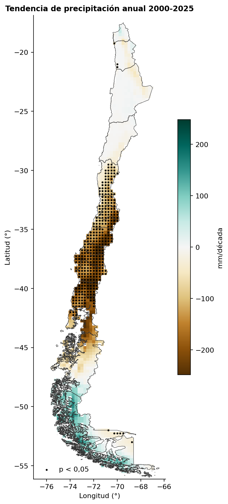
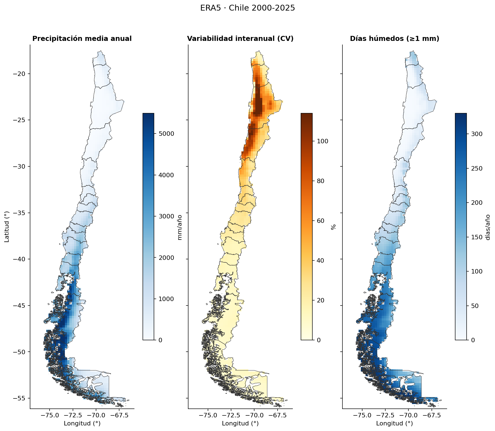

# Exploring ERA5 · Chile

Serie de proyectos para explorar el reanálisis climático **ERA5** sobre Chile
continental (2000–2025) con Python. Los datos salen directamente de
**ARCO-ERA5** en Google Cloud (Zarr público), así que no hace falta cuenta ni
cola de descargas.

| Etapa | Notebook | Estado |
|---|---|---|
| 1. Extracción horaria → diaria | [`era5_extraccion_diario.ipynb`](era5_extraccion_diario.ipynb) | ✅ |
| 2. Precipitación: agregación, extremos y tendencias | [`era5_agregacion_precipitacion.ipynb`](era5_agregacion_precipitacion.ipynb) | ✅ |
| 3. Temperatura | `era5_agregacion_temperatura.ipynb` | 🚧 en desarrollo |

---

## Precipitación en Chile 2000–2025



Este proyecto convierte 26 años de precipitación diaria ERA5 en totales
mensuales, estacionales y anuales, índices de extremos y tendencias para
Chile continental.

| Aspecto | Detalle |
|---|---|
| Fuente | ERA5 (ARCO, Google Cloud), precipitación total diaria en mm/día |
| Período | 2000-01-01 a 2025-12-31 (9.497 días, sin faltantes) |
| Grilla | 0,25° (~25 km), 157 × 45 celdas; 1.254 celdas dentro de Chile |
| Unidades espaciales | 5 zonas por latitud (Norte Grande, Norte Chico, Centro, Sur, Austral), total Chile y 9 ciudades de Arica a Punta Arenas |
| Herramientas | Python: xarray, Dask, GeoPandas, shapely, SciPy, matplotlib |

### Qué hace

1. **Agregación temporal.** Calcula totales mensuales, estacionales (DJF, MAM, JJA, SON), anuales y por año hidrológico (abril a marzo). Solo conserva los períodos completos.
2. **Índices de extremos tipo ETCCDI.** R1mm, SDII, R10mm, R20mm, Rx1day, Rx5day, CDD y R95pTOT.
3. **Climatologías y anomalías.** Calcula anomalías en mm, en % y estandarizadas (z) respecto de 2000–2025.
4. **Agregación espacial.** Saca medias ponderadas por área (cos de la latitud) por zona y series de la celda más cercana a cada ciudad.
5. **Tendencias.** Ajusta una regresión lineal del total anual en mm/década, con valor p, por celda y por zona.

### Decisiones técnicas

- **Dask perezoso, cómputo único.** Las secciones 2 a 6 solo arman grafos. Cada producto se calcula una vez en la sección 7. Calcularlo en memoria antes de escribir el NetCDF resultó unas 10 veces más rápido que escribir directamente desde Dask.
- **Un solo bloque en el tiempo.** Así los percentiles, las rachas secas y los `resample` operan sobre la serie completa de cada celda sin reagrupar.
- **Máscara de Chile** con el GeoJSON de las 16 regiones (Overture Maps, de mi [proyecto de límites administrativos](https://github.com/Zelaznog-J/extraccion-limites-administrativos-overture)) y `shapely.intersects_xy`.
- **Anomalía % solo donde la climatología es ≥ 1 mm/mes**, para no dividir casi por cero en el desierto.
- **Ciudades sin máscara**, para no perder las ciudades costeras cuya celda cae mayormente en el mar.

### Validación

- **Conservación de masa.** La suma de los 12 meses es igual al total anual en cada celda (error máximo de 0,007 mm en 26 años). Lo mismo se cumple para estaciones contra meses.
- **Coherencia de índices.** Se cumple R10mm ≤ R1mm y Rx1day ≤ Rx5day ≤ total anual en todas las celdas.

### Resultados

Entre 2000 y 2025 la precipitación disminuye de forma significativa en Chile central y sur.

| Zona | Media anual (mm) | CV (%) | Tendencia (mm/década) | Tendencia (%/década) | p | % en invierno (JJA) | Año más húmedo | Año más seco |
|---|---|---|---|---|---|---|---|---|
| Norte Grande | 165 | 27 | −5 | −3,1 | 0,68 | 9 | 2001 | 2010 |
| Norte Chico | 179 | 30 | −25 | −14,1 | 0,08 | 42 | 2002 | 2023 |
| Centro | 877 | 24 | **−147** | **−16,8** | **0,01** | 55 | 2002 | 2019 |
| Sur | 2.038 | 14 | **−191** | **−9,4** | **0,01** | 45 | 2002 | 2016 |
| Austral | 3.120 | 8 | +1 | 0,0 | 0,99 | 25 | 2017 | 2016 |
| Chile | 1.514 | 8 | −50 | −3,3 | 0,10 | 31 | 2017 | 2016 |

- **Megasequía central.** El total del Centro en 2010–2025 es 24 % menor que en 2000–2009. 2019 fue el año más seco (531 mm, 39 % bajo la media), y Santiago registró 234 mm frente a 495 mm de promedio.
- **Señal espacial.** El 27,7 % de las celdas (347 de 1.254) tiene tendencia significativa (p < 0,05). Casi todas son negativas y están entre ~30°S y ~41°S.
- **Gradiente norte–sur.** La media anual crece unas 19 veces desde el Norte Grande hasta el Austral.
- **Regímenes opuestos.** El Centro concentra el 55 % de su lluvia en invierno. El Norte Grande recibe el 63 % en verano por el invierno altiplánico.



Todas las figuras están en [`agregados_tp/figuras/`](agregados_tp/figuras/), y las series por zona y ciudad en CSV en [`agregados_tp/`](agregados_tp/).

### Limitaciones

- En el **desierto costero** ERA5 entrega valores muy por encima de lo que registran las estaciones. En la celda más cercana, Arica tiene 294 mm/año y Antofagasta 154 mm/año, frente a pocos mm/año observados. Por eso las cifras del Norte Grande deben leerse con cautela.
- Con **26 años**, las tendencias son una primera señal y no una atribución climática.
- Una celda de ~25 km no representa una estación puntual, especialmente en zonas de relieve complejo.

---

## Cómo reproducirlo

```bash
pip install xarray dask distributed netCDF4 zarr gcsfs scipy matplotlib geopandas shapely flox
```

Las rutas se configuran con variables de entorno, así que no hay que editar el código:

- `ERA5_DIR`: carpeta base del proyecto, donde se guardan la caché, los NetCDF diarios y los productos agregados. La leen los dos notebooks.
- `ERA5_REGIONES`: ruta a `chile_region.geojson`, que se obtiene con el [proyecto de límites administrativos](https://github.com/Zelaznog-J/extraccion-limites-administrativos-overture). La lee el notebook de precipitación.

1. Ejecuta `era5_extraccion_diario.ipynb`. Descarga desde ARCO-ERA5 con caché anual (`cache_era5_chile/`) y genera los NetCDF diarios en `diario_era5_chile/`. Son varios GB, por eso no están en el repositorio.
2. Ejecuta `era5_agregacion_precipitacion.ipynb`, que lee el diario del paso anterior y escribe los productos en `agregados_tp/`.

Los productos NetCDF (`agregados_tp/*.nc`) tampoco se versionan porque se regeneran en el paso 2.

## Estructura

```
exploring-era5-chile/
├── era5_extraccion_diario.ipynb
├── era5_agregacion_precipitacion.ipynb
├── agregados_tp/
│   ├── zonas_*.csv, ciudades_*.csv, resumen_zonas.csv
│   └── figuras/            # 9 figuras PNG
├── cache_era5_chile/       # (ignorado) caché horaria por año
└── diario_era5_chile/      # (ignorado) NetCDF diarios 2000–2025
```

## Créditos y licencia

- Datos: Hersbach, H. et al. (2020), *The ERA5 global reanalysis*, Q. J. R. Meteorol. Soc. Contiene información modificada del Copernicus Climate Change Service (2026). Acceso mediante [ARCO-ERA5](https://github.com/google-research/arco-era5) (Google Research).
- Límites de Chile: [Overture Maps Foundation](https://overturemaps.org/).
- Código bajo licencia MIT (ver [`LICENSE`](LICENSE)).

Autora: **Javiera González Mardones** · [Portafolio](https://zelaznog-j.github.io/) · [LinkedIn](https://www.linkedin.com/in/zelaznog-j)
