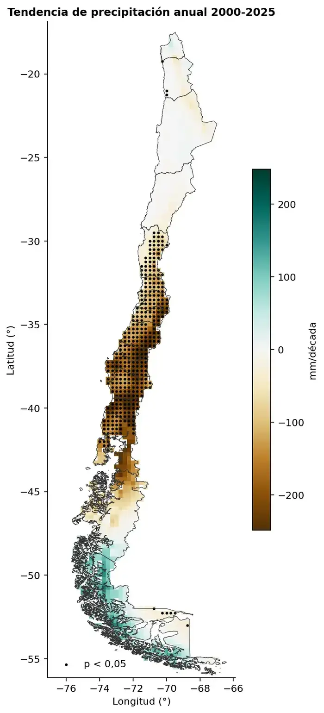
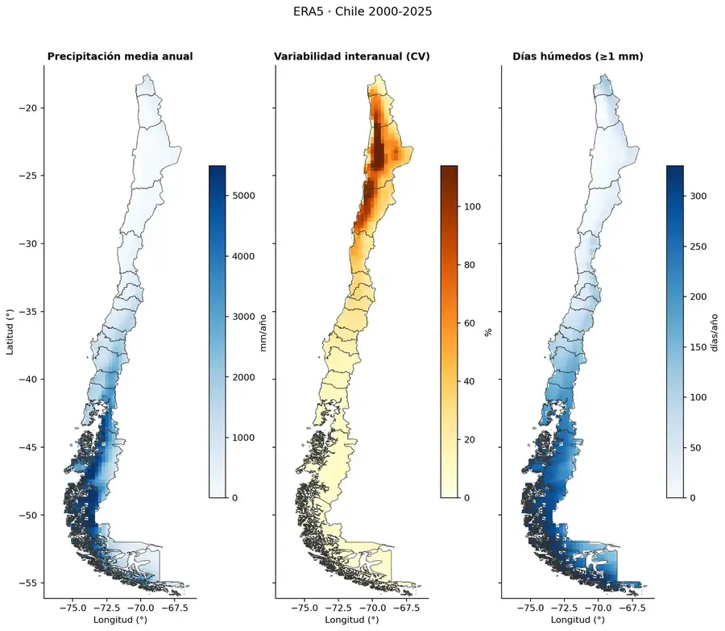
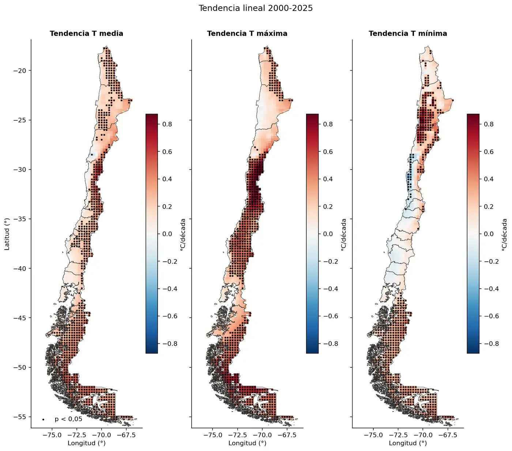
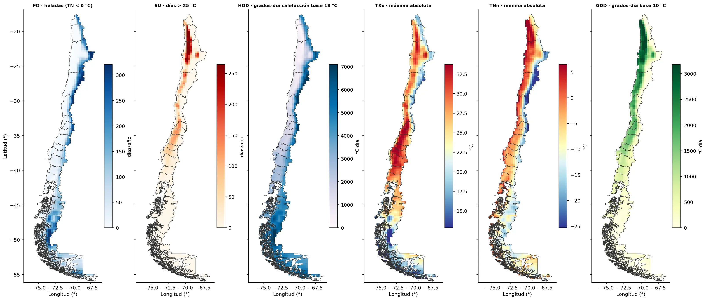

# Exploring ERA5 · Chile

Serie de proyectos para explorar el reanálisis climático **ERA5** sobre Chile
continental (2000–2025) con Python. Los datos salen directamente de
**ARCO-ERA5** en Google Cloud (Zarr público), así que no hace falta cuenta ni
cola de descargas.

| Etapa | Notebook | Estado |
|---|---|---|
| 1. Extracción horaria → diaria | [`era5_extraccion_diario.ipynb`](era5_extraccion_diario.ipynb) | ✅ |
| 2. Precipitación: agregación, extremos y tendencias | [`era5_agregacion_precipitacion.ipynb`](era5_agregacion_precipitacion.ipynb) | ✅ |
| 3. Temperatura: agregación, extremos, grados-día y tendencias | [`era5_agregacion_temperatura.ipynb`](era5_agregacion_temperatura.ipynb) | ✅ |

---

## Precipitación en Chile 2000–2025

Este proyecto convierte 26 años de precipitación diaria ERA5 en totales
mensuales, estacionales y anuales, índices de extremos y tendencias para
Chile continental.

| Aspecto | Detalle |
|---|---|
| Fuente | ERA5 (ARCO, Google Cloud), precipitación total diaria en mm/día |
| Período | 2000-01-01 a 2025-12-31 (9.497 días, sin faltantes) |
| Grilla | 0,25° (~25 km), 157 × 45 celdas; 1.254 celdas dentro de Chile |
| Unidades espaciales | 5 zonas por latitud (Norte Grande, Norte Chico, Centro, Sur, Austral), total Chile y 9 ciudades de Arica a Punta Arenas |
| Herramientas | Python: xarray, Dask, GeoPandas, shapely, SciPy, matplotlib |

### Qué hace

1. **Agregación temporal.** Calcula totales mensuales, estacionales (DJF, MAM, JJA, SON), anuales y por año hidrológico (abril a marzo). Solo conserva los períodos completos.
2. **Índices de extremos tipo ETCCDI.** R1mm, SDII, R10mm, R20mm, Rx1day, Rx5day, CDD y R95pTOT.
3. **Climatologías y anomalías.** Calcula anomalías en mm, en % y estandarizadas (z) respecto de 2000–2025.
4. **Agregación espacial.** Saca medias ponderadas por área (cos de la latitud) por zona y series de la celda más cercana a cada ciudad.
5. **Tendencias.** Ajusta una regresión lineal del total anual en mm/década, con valor p, por celda y por zona.

### Decisiones técnicas

- **Dask perezoso, cómputo único.** Las secciones 2 a 6 solo arman grafos. Cada producto se calcula una vez en la sección 7. Calcularlo en memoria antes de escribir el NetCDF resultó unas 10 veces más rápido que escribir directamente desde Dask.
- **Un solo bloque en el tiempo.** Así los percentiles, las rachas secas y los `resample` operan sobre la serie completa de cada celda sin reagrupar.
- **Máscara de Chile** con el GeoJSON de las 16 regiones (Overture Maps, de mi [proyecto de límites administrativos](https://github.com/Zelaznog-J/extraccion-limites-administrativos-overture)) y `shapely.intersects_xy`.
- **Anomalía % solo donde la climatología es ≥ 1 mm/mes**, para no dividir casi por cero en el desierto.
- **Ciudades sin máscara**, para no perder las ciudades costeras cuya celda cae mayormente en el mar.

### Validación

- **Conservación de masa.** La suma de los 12 meses es igual al total anual en cada celda (error máximo de 0,007 mm en 26 años). Lo mismo se cumple para estaciones contra meses.
- **Coherencia de índices.** Se cumple R10mm ≤ R1mm y Rx1day ≤ Rx5day ≤ total anual en todas las celdas.

### Resultados



Entre 2000 y 2025 la precipitación disminuye de forma significativa en Chile central y sur.

| Zona | Media anual (mm) | CV (%) | Tendencia (mm/década) | Tendencia (%/década) | p | % en invierno (JJA) | Año más húmedo | Año más seco |
|---|---|---|---|---|---|---|---|---|
| Norte Grande | 165 | 27 | −5 | −3,1 | 0,68 | 9 | 2001 | 2010 |
| Norte Chico | 179 | 30 | −25 | −14,1 | 0,08 | 42 | 2002 | 2023 |
| Centro | 877 | 24 | **−147** | **−16,8** | **0,01** | 55 | 2002 | 2019 |
| Sur | 2.038 | 14 | **−191** | **−9,4** | **0,01** | 45 | 2002 | 2016 |
| Austral | 3.120 | 8 | +1 | 0,0 | 0,99 | 25 | 2017 | 2016 |
| Chile | 1.514 | 8 | −50 | −3,3 | 0,10 | 31 | 2017 | 2016 |

- **Megasequía central.** El total del Centro en 2010–2025 es 24 % menor que en 2000–2009. 2019 fue el año más seco (531 mm, 39 % bajo la media), y Santiago registró 234 mm frente a 495 mm de promedio.
- **Señal espacial.** El 27,7 % de las celdas (347 de 1.254) tiene tendencia significativa (p < 0,05). Casi todas son negativas y están entre ~30°S y ~41°S.
- **Gradiente norte–sur.** La media anual crece unas 19 veces desde el Norte Grande hasta el Austral.
- **Regímenes opuestos.** El Centro concentra el 55 % de su lluvia en invierno. El Norte Grande recibe el 63 % en verano por el invierno altiplánico.



Las versiones originales están en [`agregados_tp/figuras/`](agregados_tp/figuras/), las optimizadas para web en [`agregados_tp/figuras_web/`](agregados_tp/figuras_web/), y las series por zona y ciudad en CSV en [`agregados_tp/`](agregados_tp/).

### Limitaciones

- En el **desierto costero** ERA5 entrega valores muy por encima de lo que registran las estaciones. En la celda más cercana, Arica tiene 294 mm/año y Antofagasta 154 mm/año, frente a pocos mm/año observados. Por eso las cifras del Norte Grande deben leerse con cautela.
- Con **26 años**, las tendencias son una primera señal y no una atribución climática.
- Una celda de ~25 km no representa una estación puntual, especialmente en zonas de relieve complejo.

---

## Temperatura en Chile 2000–2025



Este proyecto convierte 26 años de temperatura diaria a 2 m en medias
mensuales, estacionales y anuales, índices de extremos, grados-día y
tendencias para Chile continental. Reutiliza el flujo con Dask del proyecto de
precipitación (Ver [`era5_agregacion_precipitacion.ipynb`](era5_agregacion_precipitacion.ipynb).

| Aspecto | Detalle |
|---|---|
| Fuente | ERA5 (ARCO, Google Cloud), temperatura media, máxima y mínima diaria en °C, más la amplitud térmica diaria (`dtr = tmax − tmin`) |
| Período | 2000-01-01 a 2025-12-31 (9.497 días; 312 meses, 103 estaciones y 26 años completos) |
| Grilla | 0,25° (~25 km), 157 × 45 celdas; 1.254 celdas dentro de Chile |
| Unidades espaciales | 5 zonas por latitud (Norte Grande, Norte Chico, Centro, Sur, Austral), total Chile y 9 ciudades de Arica a Punta Arenas |
| Herramientas | Python: xarray, Dask, flox, GeoPandas, shapely, SciPy, matplotlib |

### Qué hace

1. **Agregación temporal.** Calcula medias mensuales, estacionales (DJF, MAM, JJA, SON) y anuales de la media, la máxima, la mínima y la amplitud diaria. Solo conserva los períodos completos. No calcula año hidrológico, que para temperatura no tiene sentido físico.
2. **Índices de extremos tipo ETCCDI.** TXx, TXn, TNx, TNn, FD (heladas), ID (días de hielo), SU (días > 25 °C), TR (noches tropicales), TX90p, TN10p y rachas máximas de días cálidos y de heladas.
3. **Grados-día.** De crecimiento (GDD, base 10 °C) y de calefacción (HDD, base 18 °C), útiles para agricultura y energía.
4. **Climatologías y anomalías.** Calcula anomalías en °C y estandarizadas (z) respecto de 2000–2025, y la amplitud del ciclo anual.
5. **Agregación espacial.** Saca medias ponderadas por área (cos de la latitud) por zona y series de la celda más cercana a cada ciudad.
6. **Tendencias.** Ajusta una regresión lineal de las temperaturas anuales en °C/década, con valor p, por celda y por zona.

### Decisiones técnicas

- **Promedio, no suma.** A diferencia de la precipitación, la temperatura se agrega con promedios; los conteos de días (heladas, días > 25 °C) sí se suman.
- **Dask perezoso, cómputo único.** Igual que en precipitación: las secciones 2 a 6 arman grafos y cada producto se calcula en memoria una vez, antes de escribir el NetCDF.
- **Percentiles por mes calendario.** TX90p y TN10p usan percentiles por mes calendario, una simplificación de la ventana de 5 días de ETCCDI.
- **Rachas sin cruzar el cambio de año**, con una función vectorizada vía `apply_ufunc`.
- **Anomalías en °C y z, no en %**, porque la escala en °C no tiene un cero útil.
- **Tendencias sin bucles por celda**, con `xarray.cov` y `xarray.corr`.
- **Máscara de Chile y ciudades** como en precipitación: GeoJSON de las 16 regiones para las zonas y celda más cercana sin máscara para las ciudades.

### Validación

- **Conservación de medias.** La media de los meses ponderada por días es igual a la media anual, y las estaciones son iguales a los meses (tolerancia de 0,001 °C).
- **Orden físico.** Se cumple `tmin ≤ tmedia ≤ tmax`, `TNn ≤ tmin` y `tmax ≤ TXx` en todas las celdas.
- **Coherencia de índices.** ID ≤ FD, conteos entre 0 y 366 y porcentajes entre 0 y 100.

### Resultados

Entre 2000 y 2025 Chile se calienta 0,27 °C por década (p = 0,001), y las máximas suben casi el doble que las mínimas.

| Zona | T media (°C) | Tendencia T media (°C/década) | Tendencia T máx (°C/década) | Tendencia T mín (°C/década) | Heladas (días/año) | Año más cálido | Año más frío |
|---|---|---|---|---|---|---|---|
| Norte Grande | 12,4 | **+0,24** (p = 0,03) | +0,20 (p = 0,11) | **+0,27** (p = 0,02) | 73 | 2023 | 2022 |
| Norte Chico | 9,6 | **+0,27** (p = 0,04) | **+0,43** (p = 0,009) | +0,20 (p = 0,12) | 103 | 2023 | 2022 |
| Centro | 10,8 | **+0,27** (p = 0,009) | **+0,53** (p < 0,001) | +0,03 (p = 0,79) | 66 | 2020 | 2007 |
| Sur | 9,9 | +0,17 (p = 0,09) | **+0,36** (p = 0,008) | +0,01 (p = 0,88) | 42 | 2016 | 2007 |
| Austral | 5,2 | **+0,34** (p = 0,002) | **+0,41** (p = 0,003) | **+0,29** (p = 0,002) | 99 | 2021 | 2002 |
| Chile | 9,0 | **+0,27** (p = 0,001) | **+0,37** (p < 0,001) | **+0,20** (p = 0,01) | 81 | 2016 | 2000 |

En negrita, tendencias significativas (p < 0,05).

- **Calentamiento generalizado.** El 98 % de las celdas tiene tendencia positiva en la media, y el 59,2 % (742 de 1.254) es significativa. La década 2016–2025 es 0,45 °C más cálida que 2000–2009.
- **Máximas más que mínimas.** En el Centro y el Sur las mínimas no cambian, así que la amplitud térmica diaria crece 0,50 y 0,35 °C/década (p < 0,001). En la celda de Santiago la máxima sube 0,73 °C/década y la mínima −0,02.
- **Mínimas que se enfrían en la costa.** Hay 26 celdas con tendencia negativa significativa en la mínima, entre ~28,5°S y ~34°S.
- **Más extremos cálidos.** Los días sobre el percentil 90 (TX90p) suben 3,0 puntos por década en Chile y 4,5 en el Centro. Las noches frías (TN10p) no muestran cambio significativo.
- **Agricultura y energía.** Los grados-día de crecimiento del Centro suben 63 °C·día por década, y los de calefacción bajan 92 °C·día por década en Chile.



Las versiones originales están en [`agregados_t2m/figuras/`](agregados_t2m/figuras/), las optimizadas para web en [`agregados_t2m/figuras_web/`](agregados_t2m/figuras_web/), y las series por zona y ciudad en CSV en [`agregados_t2m/`](agregados_t2m/).

### Limitaciones

- Cada zona mezcla costa, valle y cordillera, así que su media depende de la fracción de celdas andinas (por eso el Norte Chico parece más frío que el Centro).
- Una celda de ~25 km no representa una estación puntual, y en la costa la celda mixta mar-tierra suaviza la amplitud diaria.
- El día ERA5 es UTC (~20 a 20 h en Chile).
- Con **26 años**, las tendencias son una primera señal y no una atribución climática.

---

## Cómo reproducirlo

```bash
pip install xarray dask distributed netCDF4 zarr gcsfs scipy matplotlib geopandas shapely flox
```

Las rutas se configuran con variables de entorno, así que no hay que editar el código:

- `ERA5_DIR`: carpeta base del proyecto, donde se guardan la caché, los NetCDF diarios y los productos agregados. La leen los tres notebooks.
- `ERA5_REGIONES`: ruta a `chile_region.geojson`, que se obtiene con el [proyecto de límites administrativos](https://github.com/Zelaznog-J/extraccion-limites-administrativos-overture). La leen los notebooks de precipitación y temperatura.

1. Ejecuta `era5_extraccion_diario.ipynb`. Descarga desde ARCO-ERA5 con caché anual (`cache_era5_chile/`) y genera los NetCDF diarios en `diario_era5_chile/`. Son varios GB, por eso no están en el repositorio.
2. Ejecuta `era5_agregacion_precipitacion.ipynb`, que lee el diario del paso anterior y escribe los productos en `agregados_tp/`.
3. Ejecuta `era5_agregacion_temperatura.ipynb`, que lee el diario de temperatura y escribe los productos en `agregados_t2m/`.

Los productos NetCDF (`agregados_tp/*.nc` y `agregados_t2m/*.nc`) tampoco se versionan porque se regeneran en los pasos 2 y 3.

## Estructura

```
exploring-era5-chile/
├── era5_extraccion_diario.ipynb
├── era5_agregacion_precipitacion.ipynb
├── era5_agregacion_temperatura.ipynb
├── agregados_tp/
│   ├── zonas_*.csv, ciudades_*.csv, resumen_zonas.csv
│   └── figuras/            # 9 figuras PNG
├── agregados_t2m/
│   ├── zonas_*.csv, ciudades_*.csv, resumen_zonas.csv
│   └── figuras/            # 9 figuras PNG
├── cache_era5_chile/       # (ignorado) caché horaria por año
└── diario_era5_chile/      # (ignorado) NetCDF diarios 2000–2025
```

## Créditos y licencia

- Datos: Hersbach, H. et al. (2020), *The ERA5 global reanalysis*, Q. J. R. Meteorol. Soc. Contiene información modificada del Copernicus Climate Change Service (2026). Acceso mediante [ARCO-ERA5](https://github.com/google-research/arco-era5) (Google Research).
- Límites de Chile: [Overture Maps Foundation](https://overturemaps.org/).
- Código bajo licencia MIT (ver [`LICENSE`](LICENSE)).

Autora: **Javiera González Mardones** · [Portafolio](https://zelaznog-j.github.io/) · [LinkedIn](https://www.linkedin.com/in/zelaznog-j)
